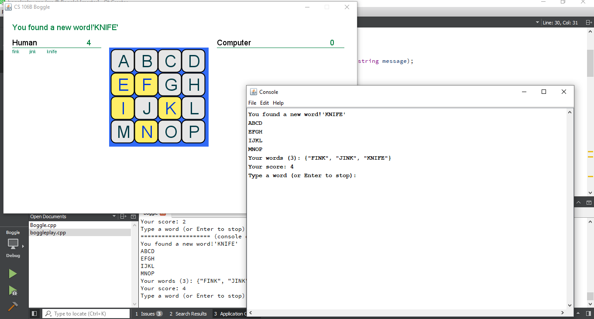

# Boggle

Its a simple game that offers to generate words from a random board to both human and computer player.

For more info and problem documentation:
http://web.stanford.edu/class/archive/cs/cs106b/cs106b.1172//assn/boggle.html

My sollution added on the following files:

[boggleplay.cpp](https://github.com/Apurba000Biswas/Boggle/blob/master/src/boggleplay.cpp)

[Boggle.cpp](https://github.com/Apurba000Biswas/Boggle/blob/master/src/Boggle.cpp)

### Game preview:

  

If you want you can watch the full video on [Youtube](https://www.youtube.com/watch?v=t7U6HJWKkW4&t=41s)

### Screen Shots:

  

  

  

  

  

#### NOTE : If you are Stanford CS 106B Student, Please Dont See the Source code. If you do you will violate the HONOR CODE